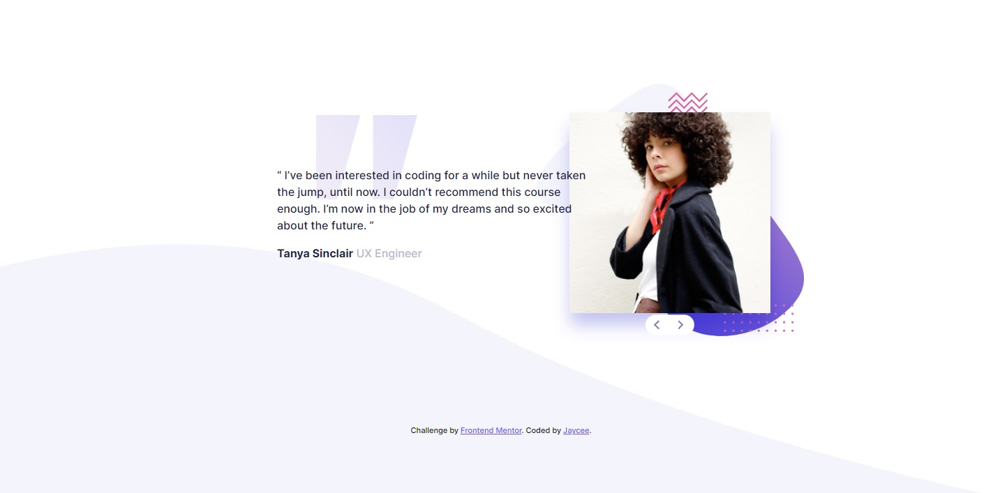

# Frontend Mentor - Coding bootcamp testimonials slider solution

This is a solution to the [Coding bootcamp testimonials slider challenge on Frontend Mentor](https://www.frontendmentor.io/challenges/coding-bootcamp-testimonials-slider-4FNyLA8JL). Frontend Mentor challenges help you improve your coding skills by building realistic projects. 

## Table of contents

- [Overview](#overview)
  - [The challenge](#the-challenge)
  - [Screenshot](#screenshot)
  - [Links](#links)
- [My process](#my-process)
  - [Built with](#built-with)
  - [What I learned](#what-i-learned)
  - [Continued development](#continued-development)
  - [Useful resources](#useful-resources)
- [Author](#author)

**Note: Delete this note and update the table of contents based on what sections you keep.**

## Overview

### The challenge

Users should be able to:

- View the optimal layout for the component depending on their device's screen size
- Navigate the slider using either their mouse/trackpad or keyboard

### Screenshot

### Links

- Solution URL: [https://github.com/simplyJC/coding-bootcamp-testimonials-slider-master](https://github.com/simplyJC/coding-bootcamp-testimonials-slider-master)
- Live Site URL: [https://sad-nightingale-d23798.netlify.app/](https://sad-nightingale-d23798.netlify.app/)

## My process

### Built with

- Semantic HTML5 markup
- CSS custom properties
- Flexbox
- CSS Grid
- Mobile-first workflow

**Note: These are just examples. Delete this note and replace the list above with your own choices**

### What I learned

I learned how to switch to other slides using InnerHTML and how to detect is user press the arrow keys to switch slides. 

### Continued development
  I would like to explore javascript programming language. Most of my projects do not have fancy animation and I am planning to learn more how to do animation in css. 

### Useful resources

- [The Fiery Coder](https://www.youtube.com/watch?v=7td4nJ083KA) - Best Resources for javascript code. This code use innerHTML. 
- [Great Resources for Event Key](https://stackoverflow.com/questions/5597060/detecting-arrow-key-presses-in-javascript) - This is an amazing answer on stackoverlow which demonstrate on how to detect if user press arrow keys
- [Animation stackoverflow source](https://stackoverflow.com/questions/8449933/animation-css3-display-opacity)

## Author
- Frontend Mentor - [@simplyJC](https://www.frontendmentor.io/profile/simplyJC)
- Twitter - [@jcaltamia](https://twitter.com/jcaltamia)
